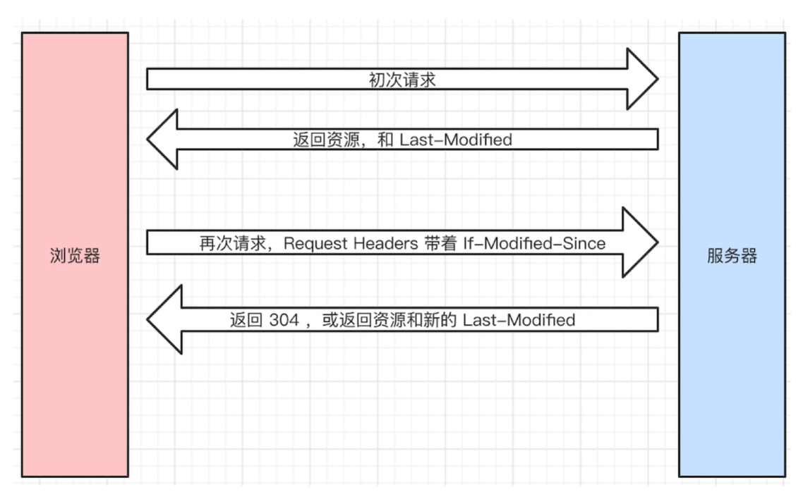

# http 和 https 协议

## 简单的面试题

1. 常见的状态码
  - 200 请求成功 301（永久重定向，配合 location）302 (类似短路径的跳转)临时重定向 
  - 304 资源未被修改 5xx 服务端错误 
  - 401 用户认证错误 403 用户认证后无权限 404 资源没有找到
2. 常见的 headers
  - request headers: 
    - accept 浏览器可接收的数据格式 accept-encoding 压缩算法，如: gzip  cookie host 
    - accept-languange 语言类型 zh-CN   Connection: keep-alive 一次 TCP 链接重复使用
    - UA 浏览器信息 Content-type 发送数据的格式，如: application/json
  - response headers:
    - Content-type 返回的数据格式，如: application/json  content-encode 返回数据采用的压缩算法
    - content-length 返回多少字节  set-cookie 返回的 cookie 
  - 自定义 header 
3. restful api
  - get 获取数据 post 新建数据 patch/put 更新数据 delete 删除数据 把 url 当成一个功能
  - restful api 把 url 当作一个唯一的资源（尽量不用 url 参数，使用 method 表示操作类型）
    - post /api/blog    patch /api/blog/100    get  /api/blog/100
4. 缓存机制
  - cache-control   expires
  - last-modified   if-modified-since
  - etag            if-none-match 

## 缓存

- 静态资源 js css img 等

### 强制缓存

 

- cache-control 的值有 max-age、no-cache (不用强制缓存)
- 同在 expires 中（旧版的，被 cache-control 替代了！）

### 协商缓存（对比缓存）

- 服务端缓存策略 
- 服务端会判断客户端资源是否和服务端资源一样，若一致 304 否则 200 和最新的资源  

 

资源标识，response headers 

- etag(人的指纹)
- last-modified(资源的最后修改时间)

- request headers 中 if-modified-since 和 last-modified 值一样

- request headers 中 if-none-match 和 etag 值一样

- 优先使用 etag ,last-modified 只能精确到秒级，资源重复生成，内容不变，etag 更精确，是根据内容来的。

### 总结

## http https 区别

- http 明文传输，敏感信息容易被中间劫持
- https 加密，有证书，劫持了无法解密（强制 https）

加密方式：对称加密、非对称加密
 

中间人攻击

证书

- 防止被别人掉包 key + public key

### 总结

