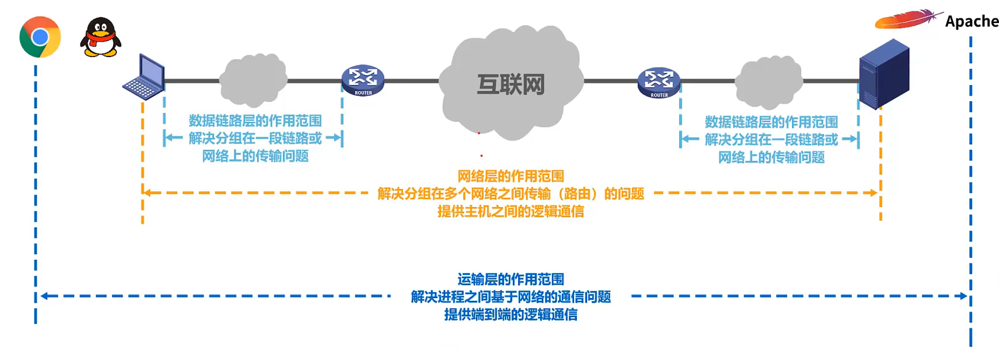

# 计算机网络基础

## 分类

### 三种交换方式

| 电路交换（电信网，电话）| 报文交换 | 分组交换（互联网）|
| ----------- | ----------- | ----------- |
| 建立连接的 | 无需建立连接的 |无需建立连接的 |
| 时延短 | 时延长 | 时延长 |
| 无额外的信息传递 | 额外信息传递（整个报文发送） | 大量额外信息传递（每个分组都要） |

### 网络种类

- 交换技术：电路交换网络、报文交换网络、分组交换网络
- 范围：WAN 广域网 、LAN 局域网、MAN 城域网、PAN(WPAN)个域网
- 拓扑：网状、总线、星型、环状

## 网络的性能指标

- 速率：连接在计算机网络上的主机在数字信道上传送数据的速率。
- 带宽：网络的通信线路传送数据的能力（单位时间内从网络中的某一个点到另外一个点所能通过的最高数据率,带宽的单位为 bit/s）
- 吞吐量：单位时间内通过某个网络（通信线路、接口）的实际的数据量。
- 时延：
  - 发送时延：主机或路由器发送数据帧所需要的时间。
  - 传播时延：电磁波在信道中传播一定的距离需要花费的时间。
  - 处理时延：主机或者路由器接受到分组时要花费一定的时间去处理。
  - 排队时延：分组在网络传输时，进入路由器后要在输入队列中排队等待处理，路由器确定转发接口后，还要在输出队列中排队等待转发，这就是排队时延。
- 时延带宽积（传播时延）
- 往返时间
- 利用率：信道利用率并非越高越好，因为引起的时延也会迅速增加
- 丢包率

## 网络体系

实际的TCP/IP协议簇
| 应用层 | 运输层 | 网际层 | 网络接口层（物理层 + 数据链路层） | 
| ----------- | ----------- | ----------- |----------- |
| 解决通过应用进程的交互来实现特定的网络应用的问题 | 解决进程之间基于网络的通信问题 | 解决分组在多个网络上传输以及路由的问题 |解决使用何种信号传输比特以及分组在一个网络上的传输问题 | 

- 两台计算机连接，采用什么传输媒体（双绞线），什么物理接口（RJ45），什么信号（高低电平表示0、1比特）？物理层

- 如何标识网络中的各主机（MAC地址），如何从数据中提取出地址数据来，信号冲突如何解决（争用信道）？数据链路层

- 如何标识网络以及网络中的各主机（IP地址），如何转发分组（路由选择）？网络层

- 如何标识哪个进程处理分组？传输错误如何处理？运输层

- 通过不同的协议来完成特定的网络应用，万维网HTTP邮件SMTP文件FTP？应用层

