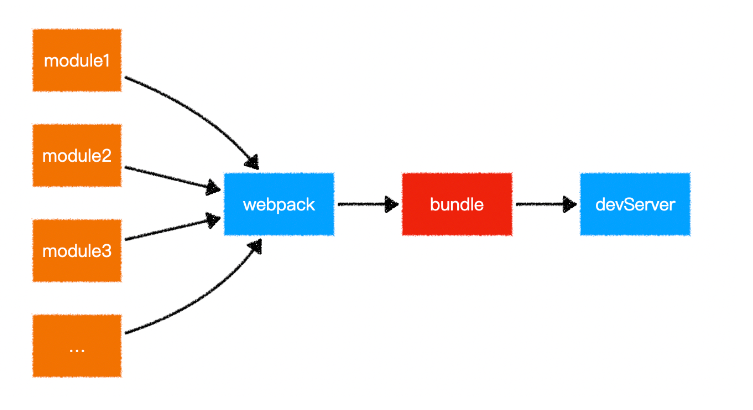
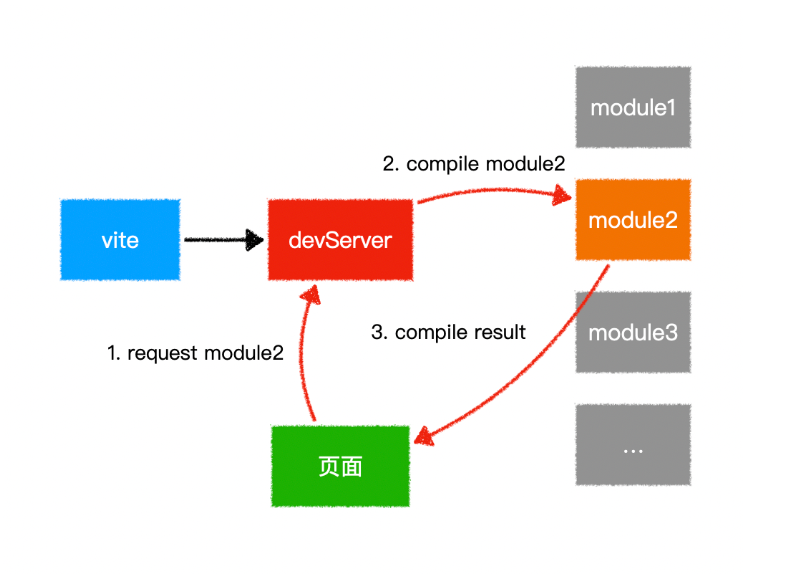
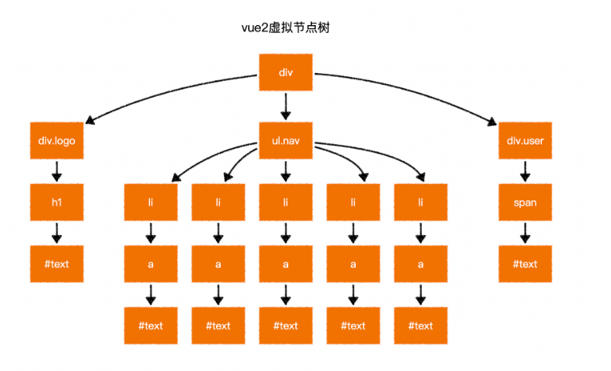
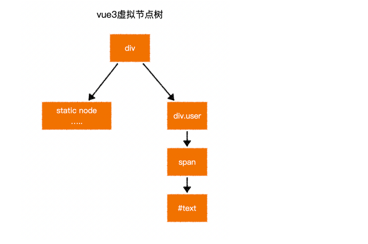
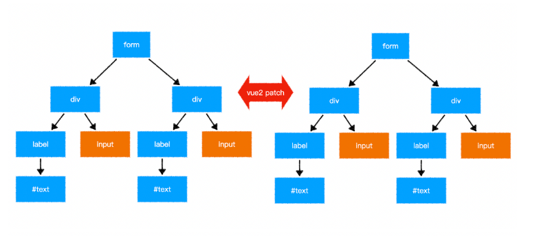
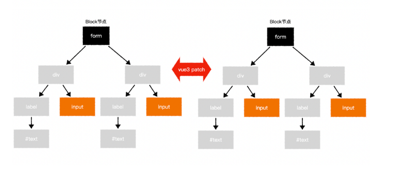
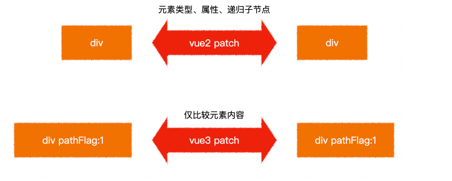
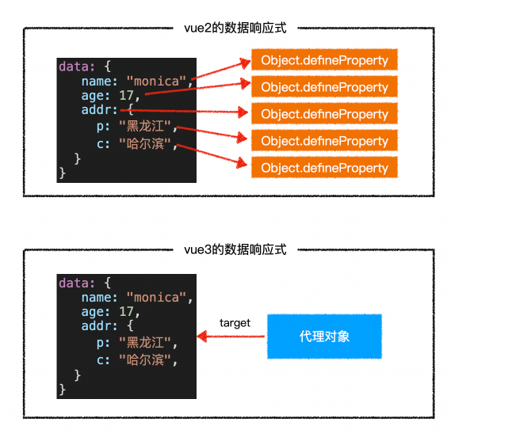

# vue3

## 搭建工程

1. vue-cli 
2. vite 构建工具 - 不仅仅是脚手架

`npm init vite-app vue3-app-vite` 每次使用最新的 vite 安装项目

差异：
  - index.html 的位置，之前是 Public vite 是根目录下。

## vue3 不同点:
  1. vue3 不存在构造函数 Vue , 而是具名导出生成实例。
    - `Uncaught SyntaxError: The requested module '/@modules/vue.js' does not provide an export named 'default'`
  2. vue3 this 指向是一个代理，而不是组件实例。
  3. composition api 区别与 option api, 相同逻辑(数据，方法)放在一起，便于阅读。

## composition-api 

1. setup 方法会在**所有**生命周期钩子函数**之前**自动执行！
  - this 指向 undefined !
  - 返回的对象属性会被附着在组件实例上。类似 data , methods ...
  - 数据改变了，但是响应式没有生效。 -> ref 封装到一个对象中，value(...访问器)
  - setup 里面，`const count = ref(0)` 是一个对象，实例中是 count.value !
  - props 属性外，其余都不怎么需要了？ 

2. ref 响应式
3. watchEffect 监控副作用
  - `watchEffect(() => {})`
  - 只要用到响应式数据，说明这个函数依赖这个响应数据，一旦变化，则重新运行这个函数。
  - mixin 可以达到聚合的目的，但是 mixin 之前互相独立的，有个参数无法处理。
4. 组件里面注册监听 hash 变化 - 需要生命周期 
  - onMounted 组件挂载完成的生命周期
  - onUnmounted 组件销毁过后的生命周期函数
5. 计算属性 
  -   `computed({ get(){}, set(val){}})` 或者 `computed(()=>{})`

## vite

> vite: https://github.com/vitejs/vite

- 面试题：谈谈你对vite的理解，最好对比webpack说明

webpack 原理图



vite 原理图



<!-- @vue/compiler-sfc -->

> 面试题答案：

- webpack会先打包，然后启动开发服务器，请求服务器时直接给予打包结果。
- 而vite是直接启动开发服务器，请求哪个模块再对该模块进行实时编译。
- 由于现代浏览器本身就支持ES Module，会自动向依赖的Module发出请求。vite充分利用这一点，将开发环境下的模块文件，就作为浏览器要执行的文件，而不是像webpack那样进行打包合并。
- 由于vite在启动的时候不需要打包，也就意味着不需要分析模块的依赖、不需要编译，因此启动速度非常快。当浏览器请求某个模块时，再根据需要对模块内容进行编译。这种按需动态编译的方式，极大的缩减了编译时间，项目越复杂、模块越多，vite的优势越明显。
- 在热更新（HMR）方面，当改动了一个模块后，仅需让浏览器重新请求该模块即可，不像webpack那样需要把该模块的相关依赖模块全部编译一次，效率更高。
- 当需要打包到生产环境时，vite使用传统的rollup进行打包，因此，vite的主要优势在开发阶段。另外，由于vite利用的是ES Module，因此在代码中不可以使用CommonJS

### 预编译(DLL)

### 支持 es module ，出现大量请求！

### vite 自带 rollup 上生产环境

### 配置开发阶段代理

## 性能提升

### 静态提升

下面的静态节点会被提升

- 元素节点
- 没有绑定动态内容

```js
// vue2 的静态节点
render(){
  createVNode("h1", null, "Hello World")
  // ...
}

// vue3 的静态节点
const hoisted = createVNode("h1", null, "Hello World")
function render(){
  // 直接使用 hoisted 即可
}
```

静态属性会被提升

```html
<div class="user">
  {{user.name}}
</div>
```

```js
const hoisted = { class: "user" }

function render(){
  createVNode("div", hoisted, user.name)
  // ...
}
```

### 预字符串化

```html
<div class="menu-bar-container">
  <div class="logo">
    <h1>logo</h1>
  </div>
  <ul class="nav">
    <li><a href="">menu</a></li>
    <li><a href="">menu</a></li>
    <li><a href="">menu</a></li>
    <li><a href="">menu</a></li>
    <li><a href="">menu</a></li>
  </ul>
  <div class="user">
    <span>{{ user.name }}</span>
  </div>
</div>
```

当编译器遇到大量连续的静态内容，会直接将其编译为一个普通字符串节点

```js
const _hoisted_2 = _createStaticVNode("<div class=\"logo\"><h1>logo</h1></div><ul class=\"nav\"><li><a href=\"\">menu</a></li><li><a href=\"\">menu</a></li><li><a href=\"\">menu</a></li><li><a href=\"\">menu</a></li><li><a href=\"\">menu</a></li></ul>")
```





### 缓存事件处理函数

```html
<button @click="count++">plus</button>
```

```js
// vue2
render(ctx){
  return createVNode("button", {
    onClick: function($event){
      ctx.count++;
    }
  })
}

// vue3
render(ctx, _cache){
  return createVNode("button", {
    onClick: cache[0] || (cache[0] = ($event) => (ctx.count++))
  })
}
```

### Block Tree

vue2在对比新旧树的时候，并不知道哪些节点是静态的，哪些是动态的，因此只能一层一层比较，这就浪费了大部分时间在比对静态节点上

```html
<form>
  <div>
    <label>账号：</label>
    <input v-model="user.loginId" />
  </div>
  <div>
    <label>密码：</label>
    <input v-model="user.loginPwd" />
  </div>
</form>
```





### PatchFlag

vue2在对比每一个节点时，并不知道这个节点哪些相关信息会发生变化，因此只能将所有信息依次比对

```html
<div class="user" data-id="1" title="user name">
  {{user.name}}
</div>
```



全局的指令、混合、插件、组件等等，都会受到影响。

### 去掉了 Vue 构造函数

在过去，如果遇到一个页面有多个`vue`应用时，往往会遇到一些问题

```html
<!-- vue2 -->
<div id="app1"></div>
<div id="app2"></div>
<script>
  Vue.use(...); // 此代码会影响所有的vue应用
  Vue.mixin(...); // 此代码会影响所有的vue应用
  Vue.component(...); // 此代码会影响所有的vue应用

	new Vue({
    // 配置
  }).$mount("#app1")

  new Vue({
    // 配置
  }).$mount("#app2")
</script>
```

在`vue3`中，去掉了`Vue`构造函数，转而使用`createApp`创建`vue`应用

```html
<!-- vue3 -->
<div id="app1"></div>
<div id="app2"></div>
<script>
	createApp(根组件).use(...).mixin(...).component(...).mount("#app1")
  createApp(根组件).mount("#app2")
</script>
```

> 更多vue应用的api：https://v3.vuejs.org/api/application-api.html

### 组件实例中的API

在`vue3`中，组件实例是一个`Proxy`，它仅提供了下列成员，功能和`vue2`一样

属性：https://v3.vuejs.org/api/instance-properties.html

方法：https://v3.vuejs.org/api/instance-methods.html

### 对比数据响应式

vue2和vue3均在相同的生命周期完成数据响应式，但做法不一样



#### 面试题参考答案

面试题1：为什么vue3中去掉了vue构造函数？

vue2的全局构造函数带来了诸多问题：

1. 调用构造函数的静态方法会对所有vue应用生效，不利于隔离不同应用
2. vue2的构造函数集成了太多功能，不利于tree shaking，vue3把这些功能使用普通函数导出，能够充分利用tree shaking优化打包体积
3. vue2没有把组件实例和vue应用两个概念区分开，在vue2中，通过new Vue创建的对象，既是一个vue应用，同时又是一个特殊的vue组件。vue3中，把两个概念区别开来，通过createApp创建的对象，是一个vue应用，它内部提供的方法是针对整个应用的，而不再是一个特殊的组件。

面试题2：谈谈你对vue3数据响应式的理解

vue3 不再使用 Object.defineProperty 的方式定义完成数据响应式，而是使用 Proxy 。
除了 Proxy 本身效率比 Object.defineProperty 更高之外，由于不必递归遍历所有属性，而是直接得到一个 Proxy。所以在 vue3 中，对数据的访问是动态的，当访问某个属性的时候，再动态的获取和设置，这就极大的提升了在组件初始阶段的效率。
同时，由于 Proxy 可以监控到成员的新增和删除，因此，在 vue3 中新增成员、删除成员、索引访问等均可以触发重新渲染，而这些在 vue2 中是难以做到的。
