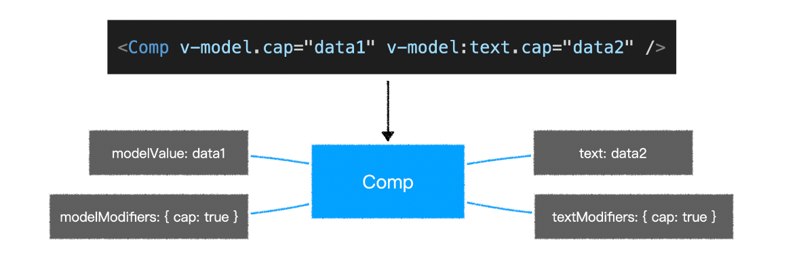

# vue3

## 搭建工程

1. vue-cli 
2. vite 构建工具 - 不仅仅是脚手架

`npm init vite-app vue3-app-vite` 每次使用最新的 vite 安装项目

差异：
  - index.html 的位置，之前是 Public vite 是根目录下。

## vue3 不同点

  1. vue3 不存在构造函数 Vue , 而是具名导出生成实例。
    - `Uncaught SyntaxError: The requested module '/@modules/vue.js' does not provide an export named 'default'`
  2. vue3 this 指向是一个代理，而不是组件实例。
  3. composition api 区别与 option api, 相同逻辑(数据，方法)放在一起，便于阅读。

### 去掉了 Vue 构造函数

在过去，如果遇到一个页面有多个`vue`应用时，往往会遇到一些问题

```html
<!-- vue2 -->
<div id="app1"></div>
<div id="app2"></div>
<script>
  Vue.use(...); // 此代码会影响所有的vue应用
  Vue.mixin(...); // 此代码会影响所有的vue应用
  Vue.component(...); // 此代码会影响所有的vue应用

	new Vue({
    // 配置
  }).$mount("#app1")

  new Vue({
    // 配置
  }).$mount("#app2")
</script>
```

在`vue3`中，去掉了`Vue`构造函数，转而使用`createApp`创建`vue`应用

```html
<!-- vue3 -->
<div id="app1"></div>
<div id="app2"></div>
<script>
	createApp(根组件).use(...).mixin(...).component(...).mount("#app1")
  createApp(根组件).mount("#app2")
</script>
```

> 更多vue应用的api：https://v3.vuejs.org/api/application-api.html

### 组件实例中的API

在`vue3`中，组件实例是一个`Proxy`，它仅提供了下列成员，功能和`vue2`一样

属性：https://v3.vuejs.org/api/instance-properties.html

方法：https://v3.vuejs.org/api/instance-methods.html

### 对比数据响应式

vue2和vue3均在相同的生命周期完成数据响应式，但做法不一样


#### 面试题参考答案

面试题1：为什么vue3中去掉了vue构造函数？

vue2的全局构造函数带来了诸多问题：

1. 调用构造函数的静态方法会对所有vue应用生效，不利于隔离不同应用
2. vue2的构造函数集成了太多功能，不利于tree shaking，vue3把这些功能使用普通函数导出，能够充分利用tree shaking优化打包体积
3. vue2没有把组件实例和vue应用两个概念区分开，在vue2中，通过new Vue创建的对象，既是一个vue应用，同时又是一个特殊的vue组件。vue3中，把两个概念区别开来，通过createApp创建的对象，是一个vue应用，它内部提供的方法是针对整个应用的，而不再是一个特殊的组件。

面试题2：谈谈你对vue3数据响应式的理解

1. vue3 不再使用 Object.defineProperty 的方式定义完成数据响应式，而是使用 Proxy 。

2. 除了 Proxy 本身效率比 Object.defineProperty 更高之外，由于不必递归遍历所有属性，而是直接得到一个 Proxy。所以在 vue3 中，对数据的访问是动态的，当访问某个属性的时候，再动态的获取和设置，这就极大的提升了在组件初始阶段的效率。

3. 同时，由于 Proxy 可以监控到成员的新增和删除，因此，在 vue3 中新增成员、删除成员、索引访问等均可以触发重新渲染，而这些在 vue2 中是难以做到的。

### 双向数据绑定

`vue2`比较让人诟病的一点就是提供了两种双向绑定：`v-model`和`.sync`，在`vue3`中，去掉了`.sync`修饰符，只需要使用`v-model`进行双向绑定即可。

为了让`v-model`更好的针对多个属性进行双向绑定，`vue3`作出了以下修改

- 当对自定义组件使用`v-model`指令时，绑定的属性名由原来的`value`变为`modelValue`，事件名由原来的`input`变为`update:modelValue`

  ```html
  <!-- vue2 -->
  <ChildComponent :value="pageTitle" @input="pageTitle = $event" />
  <!-- 简写为 -->
  <ChildComponent v-model="pageTitle" />

  <!-- vue3 -->
  <ChildComponent
    :modelValue="pageTitle"
    @update:modelValue="pageTitle = $event"
  />
  <!-- 简写为 -->
  <ChildComponent v-model="pageTitle" />
  ```

- 去掉了`.sync`修饰符，它原本的功能由`v-model`的参数替代

  ```html
  <!-- vue2 -->
  <ChildComponent :title="pageTitle" @update:title="pageTitle = $event" />
  <!-- 简写为 -->
  <ChildComponent :title.sync="pageTitle" />

  <!-- vue3 -->
  <ChildComponent :title="pageTitle" @update:title="pageTitle = $event" />
  <!-- 简写为 -->
  <ChildComponent v-model:title="pageTitle" />
  ```

- `model`配置被移除

- 允许自定义`v-model`修饰符

  vue2 无此功能

  

### v-if v-for

`v-if` 的优先级 现在高于 `v-for`

### key

- 当使用`<template>`进行`v-for`循环时，需要把`key`值放到`<template>`中，而不是它的子元素中

- 当使用`v-if v-else-if v-else`分支的时候，不再需要指定`key`值，因为`vue3`会自动给予每个分支一个唯一的`key`

  即便要手工给予`key`值，也必须给予每个分支唯一的`key`，**不能因为要重用分支而给予相同的 key**

### Fragment

`vue3`现在允许组件出现多个根节点

### 异步组件

- vue2 `import(/* webpackChunkName: "about" */ '../views/About.vue')`
- vue3 
  ```js
    // h 提升为一个普遍的方法！！
    import { defineAsyncCompontent, h } from 'vue'
    const Block1 = defineAsyncCompontent(() => import('xxx')) // () => import('xxx') 返回一个 promise 即可

    const Block2 = defineAsyncCompontent({
      // loader: () => import('xxx')
      loader: async () => {
        await delay(); // delay 为一个延时函数
        if (Math.random() < 0.5) {
          throw new Error('组件加载出错了！');
        }
        return import('xxx');
      },
      loadingCompontent: loading, // 加载状态显示这里的组件，promise 为 pending 状态时！！
      errorComponent: { // 组件以对象的形式出现！
        render() {
          return h(Error, "出错了")
        }
      }
    })
  ```

### 异步页面

- 页面也是一个组件！！！类似异步组件
- nprogress 进度条

- Suspence 组件正式版了吗？

### 内置组件 Teleport

- 属性 `<Teleport to="body" />` 改变元素真实的位置
  
## composition api 

1. setup 方法会在**所有**生命周期钩子函数**之前**自动执行！
  - this 指向 undefined !
  - 返回的对象属性会被附着在组件实例上。类似 data , methods ...
  - 数据改变了，但是响应式没有生效。 -> ref 封装到一个对象中，value(...访问器)
  - setup 里面，`const count = ref(0)` 是一个对象，实例中是 count.value !
  - props 属性外，其余都不怎么需要了？ 
  - 参数 props ctx - `ctx.emit`

2. ref 响应式
3. watchEffect 监控副作用
  - `watchEffect(() => {})`
  - 只要用到响应式数据，说明这个函数依赖这个响应数据，一旦变化，则重新运行这个函数。
  - mixin 可以达到聚合的目的，但是 mixin 之前互相独立的，有个参数无法处理。
4. 组件里面注册监听 hash 变化 - 需要生命周期 
  - onMounted 组件挂载完成的生命周期
  - onUnmounted 组件销毁过后的生命周期函数
5. 计算属性 
  -   `computed({ get(){}, set(val){}})` 或者 `computed(()=>{})`

## vite

> vite: https://github.com/vitejs/vite

- 面试题：谈谈你对vite的理解，最好对比webpack说明

webpack 原理图


vite 原理图


<!-- @vue/compiler-sfc -->

> 面试题答案：

- webpack会先打包，然后启动开发服务器，请求服务器时直接给予打包结果。
- 而vite是直接启动开发服务器，请求哪个模块再对该模块进行实时编译。
- 由于现代浏览器本身就支持ES Module，会自动向依赖的Module发出请求。vite充分利用这一点，将开发环境下的模块文件，就作为浏览器要执行的文件，而不是像webpack那样进行打包合并。
- 由于vite在启动的时候不需要打包，也就意味着不需要分析模块的依赖、不需要编译，因此启动速度非常快。当浏览器请求某个模块时，再根据需要对模块内容进行编译。这种按需动态编译的方式，极大的缩减了编译时间，项目越复杂、模块越多，vite的优势越明显。
- 在热更新（HMR）方面，当改动了一个模块后，仅需让浏览器重新请求该模块即可，不像webpack那样需要把该模块的相关依赖模块全部编译一次，效率更高。
- 当需要打包到生产环境时，vite使用传统的rollup进行打包，因此，vite的主要优势在开发阶段。另外，由于vite利用的是ES Module，因此在代码中不可以使用CommonJS

### 总结

1. 预编译(DLL)
2. 支持 es module ，出现大量请求！
3. vite 自带 rollup 上生产环境
4. 配置开发阶段代理

## 性能提升

### 静态提升

下面的静态节点会被提升

- 元素节点
- 没有绑定动态内容

```js
// vue2 的静态节点
render(){
  createVNode("h1", null, "Hello World")
  // ...
}

// vue3 的静态节点
const hoisted = createVNode("h1", null, "Hello World")
function render(){
  // 直接使用 hoisted 即可
}
```

静态属性会被提升

```html
<div class="user">
  {{user.name}}
</div>
```

```js
const hoisted = { class: "user" }

function render(){
  createVNode("div", hoisted, user.name)
  // ...
}
```

### 预字符串化

```html
<div class="menu-bar-container">
  <div class="logo">
    <h1>logo</h1>
  </div>
  <ul class="nav">
    <li><a href="">menu</a></li>
    <li><a href="">menu</a></li>
    <li><a href="">menu</a></li>
    <li><a href="">menu</a></li>
    <li><a href="">menu</a></li>
  </ul>
  <div class="user">
    <span>{{ user.name }}</span>
  </div>
</div>
```

当编译器遇到大量连续的静态内容，会直接将其编译为一个普通字符串节点

```js
const _hoisted_2 = _createStaticVNode("<div class=\"logo\"><h1>logo</h1></div><ul class=\"nav\"><li><a href=\"\">menu</a></li><li><a href=\"\">menu</a></li><li><a href=\"\">menu</a></li><li><a href=\"\">menu</a></li><li><a href=\"\">menu</a></li></ul>")
```


### 缓存事件处理函数

```html
<button @click="count++">plus</button>
```

```js
// vue2
render(ctx){
  return createVNode("button", {
    onClick: function($event){
      ctx.count++;
    }
  })
}

// vue3
render(ctx, _cache){
  return createVNode("button", {
    onClick: cache[0] || (cache[0] = ($event) => (ctx.count++))
  })
}
```

### Block Tree

vue2在对比新旧树的时候，并不知道哪些节点是静态的，哪些是动态的，因此只能一层一层比较，这就浪费了大部分时间在比对静态节点上

```html
<form>
  <div>
    <label>账号：</label>
    <input v-model="user.loginId" />
  </div>
  <div>
    <label>密码：</label>
    <input v-model="user.loginPwd" />
  </div>
</form>
```


### PatchFlag

vue2在对比每一个节点时，并不知道这个节点哪些相关信息会发生变化，因此只能将所有信息依次比对

```html
<div class="user" data-id="1" title="user name">
  {{user.name}}
</div>
```


全局的指令、混合、插件、组件等等，都会受到影响。

## reactivity api

> reactivity api: https://v3.vuejs.org/api/reactivity-api

### 获取响应式数据

| API        | 传入                      | 返回             | 备注                                                         |
| :--------- | ------------------------- | ---------------- | ------------------------------------------------------------ |
| `reactive` | `plain-object`            | `对象代理`       | 深度代理对象中的所有成员                                     |
| `readonly` | `plain-object` or `proxy` | `对象代理`       | 只能读取代理对象中的成员，不可修改                           |
| `ref`      | `any`                     | `{ value: ... }` | 对value的访问是响应式的<br />如果给value的值是一个对象，<br />则会通过`reactive`函数进行代理<br />如果已经是代理，则直接使用代理 |
| `computed` | `function`                | `{ value: ... }` | 当读取value值时，<br />会**根据情况**决定是否要运行函数      |

应用：

- 如果想要让一个对象变为响应式数据，可以使用`reactive`或`ref`
- 如果想要让一个对象的所有属性只读，使用`readonly`
- 如果想要让一个非对象数据变为响应式数据，使用`ref`
- 如果想要根据已知的响应式数据得到一个新的响应式数据，使用`computed`

笔试题1：下面的代码输出结果是什么？

```js
import { reactive, readonly, ref, computed } from "vue";

const state = reactive({
  firstName: "Xu Ming",
  lastName: "Deng",
});
const fullName = computed(() => {
  console.log("changed");
  return `${state.lastName}, ${state.firstName}`;
});
console.log("state ready");
console.log("fullname is", fullName.value);
console.log("fullname is", fullName.value);
const imState = readonly(state);
console.log(imState === state);

const stateRef = ref(state);
console.log(stateRef.value === state);

state.firstName = "Cheng";
state.lastName = "Ji";

console.log(imState.firstName, imState.lastName);
console.log("fullname is", fullName.value);
console.log("fullname is", fullName.value);

const imState2 = readonly(stateRef);
console.log(imState2.value === stateRef.value);

```

笔试题2：按照下面的要求完成函数

```js
function useUser(){
  // 在这里补全函数
  return {
    user, // 这是一个只读的用户对象，响应式数据，默认为一个空对象
    setUserName, // 这是一个函数，传入用户姓名，用于修改用户的名称
    setUserAge, // 这是一个函数，传入用户年龄，用户修改用户的年龄
  }
}
```

笔试题3：按照下面的要求完成函数

```js
function useDebounce(obj, duration){
  // 在这里补全函数
  return {
    value, // 这里是一个只读对象，响应式数据，默认值为参数值
    setValue // 这里是一个函数，传入一个新的对象，需要把新对象中的属性混合到原始对象中，混合操作需要在duration的时间中防抖
  }
}
```

### 监听数据变化

**watchEffect**

```js
const stop = watchEffect(() => {
  // 该函数会立即执行，然后追中函数中用到的响应式数据，响应式数据变化后会再次执行
})

// 通过调用stop函数，会停止监听
stop(); // 停止监听
```

**watch**

```js
// 等效于vue2的$watch

// 监听单个数据的变化
const state = reactive({ count: 0 })
watch(() => state.count, (newValue, oldValue) => {
  // ...
}, options)

const countRef = ref(0);
watch(countRef, (newValue, oldValue) => {
  // ...
}, options)

// 监听多个数据的变化
watch([() => state.count, countRef], ([new1, new2], [old1, old2]) => {
  // ...
});
```

**注意：无论是`watchEffect`还是`watch`，当依赖项变化时，回调函数的运行都是异步的（微队列）**

应用：除非遇到下面的场景，否则均建议选择`watchEffect`

- 不希望回调函数一开始就执行
- 数据改变时，需要参考旧值
- 需要监控一些回调函数中不会用到的数据

笔试题: 下面的代码输出结果是什么？

```js
import { reactive, watchEffect, watch } from "vue";
const state = reactive({
  count: 0,
});
watchEffect(() => {
  console.log("watchEffect", state.count);
});
watch(
  () => state.count,
  (count, oldCount) => {
    console.log("watch", count, oldCount);
  }
);
console.log("start");
setTimeout(() => {
  console.log("time out");
  state.count++;
  state.count++;
});
state.count++;
state.count++;

console.log("end");

```

### 判断

| API          | 含义                                                         |
| ------------ | ------------------------------------------------------------ |
| `isProxy`    | 判断某个数据是否是由`reactive`或`readonly`                   |
| `isReactive` | 判断某个数据是否是通过`reactive`创建的<br />详细:https://v3.vuejs.org/api/basic-reactivity.html#isreactive |
| `isReadonly` | 判断某个数据是否是通过`readonly`创建的                       |
| `isRef`      | 判断某个数据是否是一个`ref`对象                              |

### 转换

**unref**

等同于：`isRef(val) ? val.value : val`

应用：

```js
function useNewTodo(todos){
  todos = unref(todos);
  // ...
}
```

**toRef**

得到一个响应式对象某个属性的ref格式

```js
const state = reactive({
  foo: 1,
  bar: 2
})

const fooRef = toRef(state, 'foo'); // fooRef: {value: ...}

fooRef.value++
console.log(state.foo) // 2

state.foo++
console.log(fooRef.value) // 3
```

**toRefs**

把一个响应式对象的所有属性转换为ref格式，然后包装到一个`plain-object`中返回

```js
const state = reactive({
  foo: 1,
  bar: 2
})

const stateAsRefs = toRefs(state)
/*
stateAsRefs: not a proxy
{
  foo: { value: ... },
  bar: { value: ... }
}
*/
```

应用：

```js
setup(){
  const state1 = reactive({a:1, b:2});
  const state2 = reactive({c:3, d:4});
  return {
    ...state1, // lost reactivity
    ...state2 // lost reactivity
  }
}

setup(){
  const state1 = reactive({a:1, b:2});
  const state2 = reactive({c:3, d:4});
  return {
    ...toRefs(state1), // reactivity
    ...toRefs(state2) // reactivity
  }
}
// composition function
function usePos(){
  const pos = reactive({x:0, y:0});
  return pos;
}

setup(){
  const {x, y} = usePos(); // lost reactivity
  const {x, y} = toRefs(usePos()); // reactivity
}
```

### 降低心智负担

所有的`composition function`均以`ref`的结果返回，以保证`setup`函数的返回结果中不包含`reactive`或`readonly`直接产生的数据

```js
function usePos(){
  const pos = reactive({ x:0, y:0 });
  return toRefs(pos); //  {x: refObj, y: refObj}
}
function useBooks(){
  const books = ref([]);
  return {
    books // books is refObj
  }
}
function useLoginUser(){
  const user = readonly({
    isLogin: false,
    loginId: null
  });
  return toRefs(user); // { isLogin: refObj, loginId: refObj }  all ref is readonly
}

setup(){
  // 在setup函数中，尽量保证解构、展开出来的所有响应式数据均是ref
  return {
    ...usePos(),
    ...useBooks(),
    ...useLoginUser()
  }
}
```

## composition api (补充)

> 面试题：composition api相比于option api有哪些优势？

不同于reactivity api，composition api提供的函数很多是与组件深度绑定的，不能脱离组件而存在。

### setup

```js
// component
export default {
  setup(props, context){
    // 该函数在组件属性被赋值后立即执行，早于所有生命周期钩子函数
    // props 是一个对象，包含了所有的组件属性值
    // context 是一个对象，提供了组件所需的上下文信息
  }
}
```

context对象的成员

| 成员  | 类型 | 说明                    |
| ----- | ---- | ----------------------- |
| attrs | 对象 | 同`vue2`的`this.$attrs` |
| slots | 对象 | 同`vue2`的`this.$slots` |
| emit  | 方法 | 同`vue2`的`this.$emit`  |

### 生命周期函数

| vue2 option api | vue3 option api       | vue 3 composition api           |
| --------------- | --------------------- | ------------------------------- |
| beforeCreate    | beforeCreate          | 不再需要，代码可直接置于setup中 |
| created         | created               | 不再需要，代码可直接置于setup中 |
| beforeMount     | beforeMount           | onBeforeMount                   |
| mounted         | mounted               | onMounted                       |
| beforeUpdate    | beforeUpdate          | onBeforeUpdate                  |
| updated         | updated               | onUpdated                       |
| beforeDestroy   | ==改== beforeUnmount  | onBeforeUnmount                 |
| destroyed       | ==改==unmounted       | onUnmounted                     |
| errorCaptured   | errorCaptured         | onErrorCaptured                 |
| -               | ==新==renderTracked   | onRenderTracked                 |
| -               | ==新==renderTriggered | onRenderTriggered               |

新增钩子函数说明：

| 钩子函数        | 参数          | 执行时机                       |
| --------------- | ------------- | ------------------------------ |
| renderTracked   | DebuggerEvent | 渲染vdom收集到的每一次依赖时   |
| renderTriggered | DebuggerEvent | 某个依赖变化导致组件重新渲染时 |

DebuggerEvent:

- target: 跟踪或触发渲染的对象
- key: 跟踪或触发渲染的属性
- type: 跟踪或触发渲染的方式

### 面试题参考答案

面试题：composition api相比于option api有哪些优势？

> 从两个方面回答：
>
> 1. 为了更好的逻辑复用和代码组织
> 2. 更好的类型推导

```
有了composition api，配合reactivity api，可以在组件内部进行更加细粒度的控制，使得组件中不同的功能高度聚合，提升了代码的可维护性。对于不同组件的相同功能，也能够更好的复用。
相比于option api，composition api中没有了指向奇怪的this，所有的api变得更加函数式，这有利于和类型推断系统比如TS深度配合。
```

### gsap 库 ，逐渐变化
