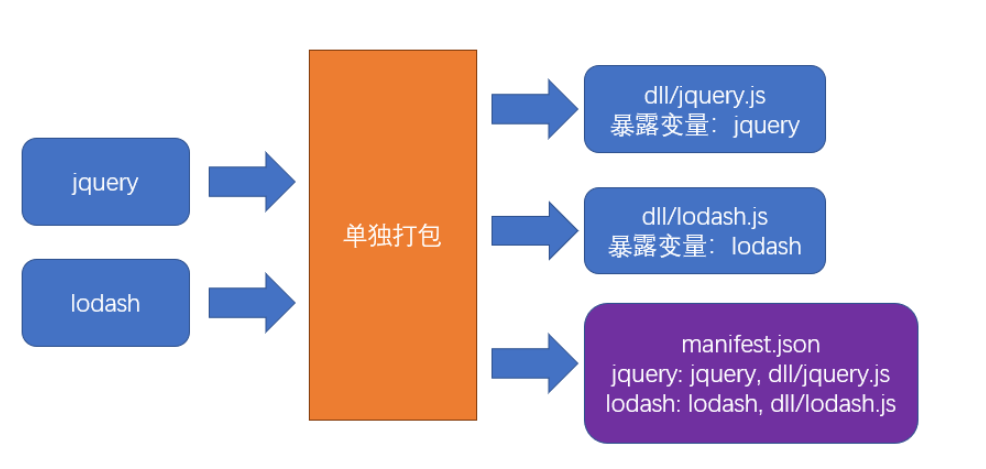
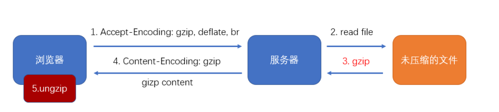
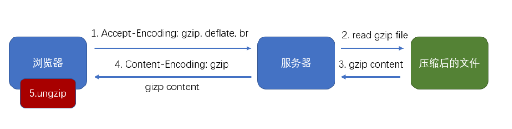

# 性能优化 - 传输

## 手动分包

### 基本原理

手动分包的总体思路是：

1. 先单独的打包公共模块



公共模块会被打包成为动态链接库(dll Dynamic Link Library)，并生成资源清单

2. 根据入口模块进行正常打包

打包时，如果发现模块中使用了资源清单中描述的模块，则不会形成下面的代码结构

```js
//源码，入口文件index.js
import $ from "jquery"
import _ from "lodash"
_.isArray($(".red"));
```

由于资源清单中包含`jquery`和`lodash`两个模块，因此打包结果的大致格式是：

```js
(function(modules){
  //...
})({
  // index.js文件的打包结果并没有变化
  "./src/index.js":
  function(module, exports, __webpack_require__){
    var $ = __webpack_require__("./node_modules/jquery/index.js")
    var _ = __webpack_require__("./node_modules/lodash/index.js")
    _.isArray($(".red"));
  },
  // 由于资源清单中存在，jquery的代码并不会出现在这里
  "./node_modules/jquery/index.js":
  function(module, exports, __webpack_require__){
    module.exports = jquery;
  },
  // 由于资源清单中存在，lodash的代码并不会出现在这里
  "./node_modules/lodash/index.js":
  function(module, exports, __webpack_require__){
    module.exports = lodash;
  }
})
```

### 打包公共模块

打包公共模块是一个**独立的**打包过程

1. 单独打包公共模块，暴露变量名

```js
// webpack.dll.config.js
module.exports = {
  mode: "production",
  entry: {
    jquery: ["jquery"],
    lodash: ["lodash"]
  },
  output: {
    filename: "dll/[name].js",
    library: "[name]"
  }
};

```

2. 利用`DllPlugin`生成资源清单

```js
// webpack.dll.config.js
module.exports = {
  plugins: [
    new webpack.DllPlugin({
      path: path.resolve(__dirname, "dll", "[name].manifest.json"), //资源清单的保存位置
      name: "[name]"//资源清单中，暴露的变量名
    })
  ]
};

```

运行后，即可完成公共模块打包

### 使用公共模块

1. 在页面中手动引入公共模块

```html
<script src="./dll/jquery.js"></script>
<script src="./dll/lodash.js"></script>
```

2. 重新设置`clean-webpack-plugin`

如果使用了插件`clean-webpack-plugin`，为了避免它把公共模块清除，需要做出以下配置

```js
new CleanWebpackPlugin({
  // 要清除的文件或目录
  // 排除掉dll目录本身和它里面的文件
  cleanOnceBeforeBuildPatterns: ["**/*", '!dll', '!dll/*']
})
```

> 目录和文件的匹配规则使用的是[globbing patterns](https://github.com/sindresorhus/globby#globbing-patterns)

3. 使用`DllReferencePlugin`控制打包结果

```js
module.exports = {
  plugins:[
    new webpack.DllReferencePlugin({
      manifest: require("./dll/jquery.manifest.json")
    }),
    new webpack.DllReferencePlugin({
      manifest: require("./dll/lodash.manifest.json")
    })
  ]
}

```

### 总结

**手动打包的过程**：

1. 开启`output.library`暴露公共模块
2. 用`DllPlugin`创建资源清单
3. 用`DllReferencePlugin`使用资源清单

**手动打包的注意事项**：

1. 资源清单不参与运行，可以不放到打包目录中
2. 记得手动引入公共JS，以及避免被删除
3. 不要对小型的公共JS库使用

**优点**：

1. 极大提升自身模块的打包速度
2. 极大的缩小了自身文件体积
3. 有利于浏览器缓存第三方库的公共代码

**缺点**：

1. 使用非常繁琐
2. 如果第三方库中包含重复代码，则效果不太理想

## 自动分包

### 基本原理

不同与手动分包，自动分包是从**实际的角度**出发，从一个更加**宏观的角度**来控制分包，而一般不对具体哪个包要分出去进行控制

因此使用自动分包，不仅非常方便，而且更加贴合实际的开发需要

要控制自动分包，关键是要配置一个合理的**分包策略**

有了分包策略之后，不需要额外安装任何插件，webpack会自动的按照策略进行分包

> 实际上，webpack在内部是使用`SplitChunksPlugin`进行分包的
> 过去有一个库`CommonsChunkPlugin`也可以实现分包，不过由于该库某些地方并不完善，到了`webpack4`之后，已被`SplitChunksPlugin`取代


从分包流程中至少可以看出以下几点：

- 分包策略至关重要，它决定了如何分包
- 分包时，webpack开启了一个**新的chunk**，对分离的模块进行打包
- 打包结果中，公共的部分被提取出来形成了一个单独的文件，它是新chunk的产物

### 分包策略的基本配置

webpack提供了`optimization`配置项，用于配置一些优化信息

其中`splitChunks`是分包策略的配置

```js
module.exports = {
  optimization: {
    splitChunks: {
      // 分包策略
    }
  }
}
```

事实上，分包策略有其默认的配置，我们只需要轻微的改动，即可应对大部分分包场景

1. chunks

该配置项用于配置需要应用分包策略的chunk

我们知道，分包是从已有的chunk中分离出新的chunk，那么哪些chunk需要分离呢

chunks有三个取值，分别是：

- all: 对于所有的chunk都要应用分包策略
- async：【默认】仅针对异步chunk应用分包策略
- initial：仅针对普通chunk应用分包策略

所以，你只需要配置`chunks`为`all`即可

2. maxSize

该配置可以控制包的最大字节数

如果某个包（包括分出来的包）超过了该值，则webpack会尽可能的将其分离成多个包

但是不要忽略的是，分包的**基础单位是模块**，如果一个完整的模块超过了该体积，它是无法做到再切割的，因此，尽管使用了这个配置，完全有可能某个包还是会超过这个体积

另外，该配置看上去很美妙，实际意义其实不大

因为分包的目的是**提取大量的公共代码**，从而减少总体积和充分利用浏览器缓存

虽然该配置可以把一些包进行再切分，但是实际的总体积和传输量并没有发生变化

> 如果要进一步减少公共模块的体积，只能是压缩和`tree shaking`

### 分包策略的其他配置

如果不想使用其他配置的默认值，可以手动进行配置：

- automaticNameDelimiter：新chunk名称的分隔符，默认值~
- minChunks：一个模块被多少个chunk使用时，才会进行分包，默认值1
- minSize：当分包达到多少字节后才允许被真正的拆分，默认值30000

### 缓存组

之前配置的分包策略是全局的

而实际上，分包策略是基于缓存组的

每个缓存组提供一套独有的策略，webpack按照缓存组的优先级依次处理每个缓存组，被缓存组处理过的分包不需要再次分包

默认情况下，webpack提供了两个缓存组：

```js
module.exports = {
  optimization:{
    splitChunks: {
      //全局配置
      cacheGroups: {
        // 属性名是缓存组名称，会影响到分包的chunk名
        // 属性值是缓存组的配置，缓存组继承所有的全局配置，也有自己特殊的配置
        vendors: {
          test: /[\\/]node_modules[\\/]/, // 当匹配到相应模块时，将这些模块进行单独打包
          priority: -10 // 缓存组优先级，优先级越高，该策略越先进行处理，默认值为0
        },
        default: {
          minChunks: 2,  // 覆盖全局配置，将最小chunk引用数改为2
          priority: -20, // 优先级
          reuseExistingChunk: true // 重用已经被分离出去的chunk
        }
      }
    }
  }
}
```

很多时候，缓存组对于我们来说没什么意义，因为默认的缓存组就已经够用了

但是我们同样可以利用缓存组来完成一些事情，比如对公共样式的抽离

```js
module.exports = {
  optimization: {
    splitChunks: {
      chunks: "all",
      cacheGroups: {
        styles: {
          test: /\.css$/, // 匹配样式模块
          minSize: 0, // 覆盖默认的最小尺寸，这里仅仅是作为测试
          minChunks: 2 // 覆盖默认的最小chunk引用数
        }
      }
    }
  },
  module: {
    rules: [{ test: /\.css$/, use: [MiniCssExtractPlugin.loader, "css-loader"] }]
  },
  plugins: [
    new CleanWebpackPlugin(),
    new HtmlWebpackPlugin({
      template: "./public/index.html",
      chunks: ["index"]
    }),
    new MiniCssExtractPlugin({
      filename: "[name].[hash:5].css",
      // chunkFilename是配置来自于分割chunk的文件名
      chunkFilename: "common.[hash:5].css"
    })
  ]
}
```

### 配合多页应用

虽然现在单页应用是主流，但免不了还是会遇到多页应用

由于在多页应用中需要为每个html页面指定需要的chunk，这就造成了问题

```js
new HtmlWebpackPlugin({
  template: "./public/index.html",
  chunks: ["index~other", "vendors~index~other", "index"]
})
```

我们必须手动的指定被分离出去的chunk名称，这不是一种好办法

幸好`html-webpack-plugin`的新版本中解决了这一问题

```shell
npm i -D html-webpack-plugin@next
```

做出以下配置即可：

```js
new HtmlWebpackPlugin({
  template: "./public/index.html",
  chunks: ["index"]
})
```

它会自动的找到被`index`分离出去的chunk，并完成引用

> 目前这个版本仍处于测试解决，还未正式发布？现在呢？

### 原理

自动分包的原理其实并不复杂，主要经过以下步骤：

1. 检查每个chunk编译的结果
2. 根据分包策略，找到那些满足策略的模块
3. 根据分包策略，生成新的chunk打包这些模块（代码有所变化）
4. 把打包出去的模块从原始包中移除，并修正原始包代码

在代码层面，有以下变动

1. 分包的代码中，加入一个全局变量，类型为数组，其中包含公共模块的代码
2. 原始包的代码中，使用数组中的公共代码

## 压缩代码

### 前言

1. **为什么要进行代码压缩**

减少代码体积；破坏代码的可读性，提升破解成本；

2. **什么时候要进行代码压缩**

生产环境

3. **使用什么压缩工具**

目前最流行的代码压缩工具主要有两个：`UglifyJs`和`Terser`

`UglifyJs`是一个传统的代码压缩工具，已存在多年，曾经是前端应用的必备工具，但由于它不支持`ES6`语法，所以目前的流行度已有所下降。

`Terser`是一个新起的代码压缩工具，支持`ES6+`语法，因此被很多构建工具内置使用。`webpack`安装后会内置`Terser`，当启用生产环境后即可用其进行代码压缩。

因此，我们选择`Terser`

**关于副作用 side effect**

副作用：函数运行过程中，可能会对外部环境造成影响的功能

如果函数中包含以下代码，该函数叫做副作用函数:

- 异步代码
- localStorage
- 对外部数据的修改

如果一个函数没有副作用，同时，函数的返回结果仅依赖参数，则该函数叫做纯函数(pure function)

### Terser

在`Terser`的官网可尝试它的压缩效果

> Terser官网：https://terser.org/

### webpack + Terser

webpack自动集成了Terser

如果你想更改、添加压缩工具，又或者是想对Terser进行配置，使用下面的webpack配置即可

```js
const TerserPlugin = require('terser-webpack-plugin');
const OptimizeCSSAssetsPlugin = require('optimize-css-assets-webpack-plugin');
module.exports = {
  optimization: {
    // 是否要启用压缩，默认情况下，生产环境会自动开启
    minimize: true,
    minimizer: [ // 压缩时使用的插件，可以有多个
      new TerserPlugin(),
      new OptimizeCSSAssetsPlugin()
    ],
  },
};
```

## tree shaking

> 可以移除模块之间的无效代码。

### 背景

某些模块导出的代码并不一定会被用到。

```js
// myMath.js
export function add(a, b){
  console.log("add")
  return a+b;
}

export function sub(a, b){
  console.log("sub")
  return a-b;
}
```

```js
// index.js
import {add} from "./myMath"
console.log(add(1,2));
```

tree shaking 用于移除掉不会用到的导出。

### 使用

`webpack2`开始就支持了`tree shaking`。

只要是生产环境，`tree shaking`自动开启。

### 原理

webpack 会从入口模块出发寻找依赖关系，当解析一个模块时，webpack 会根据 ES6 的模块导入语句来判断，该模块依赖了另一个模块的哪个导出。

webpack 之所以选择 ES6 的模块导入语句，是因为ES6模块有以下特点：

1. 导入导出语句只能是顶层语句
2. import 的模块名只能是字符串常量
3. import 绑定的变量是不可变的

这些特征都非常有利于分析出稳定的依赖。

在具体分析依赖时，webpack坚持的原则是：**保证代码正常运行，然后再尽量tree shaking**。

所以，如果你依赖的是一个导出的对象，由于JS语言的动态特性，以及`webpack`还不够智能，为了保证代码正常运行，它不会移除对象中的任何信息。

因此，我们在编写代码的时候，**尽量**：

- 使用`export xxx`导出，而不使用`export default {xxx}`导出
- 使用`import { xxx } from "xxx"`导入，而不使用`import xxx from "xxx"`导入


依赖分析完毕后，`webpack`会根据每个模块每个导出是否被使用，标记其他导出为`dead code`，然后交给代码压缩工具处理

代码压缩工具最终移除掉那些`dead code`代码

### 使用第三方库

某些第三方库可能使用的是`commonjs`的方式导出，比如`lodash`

又或者没有提供普通的ES6方式导出

对于这些库，`tree shaking`是无法发挥作用的

因此要寻找这些库的`es6`版本，好在很多流行但没有使用的`ES6`的第三方库，都发布了它的`ES6`版本，比如`lodash-es`

### 作用域分析

`tree shaking`本身并没有完善的作用域分析，可能导致在一些`dead code`函数中的依赖仍然会被视为依赖

插件`webpack-deep-scope-plugin`提供了作用域分析，可解决这些问题。

### 副作用问题

webpack在`tree shaking`的使用，有一个原则：**一定要保证代码正确运行**

在满足该原则的基础上，再来决定如何`tree shaking`

因此，当`webpack`无法确定某个模块是否有副作用时，它往往将其视为有副作用

因此，某些情况可能并不是我们所想要的

```js
//common.js
var n  = Math.random();

//index.js
import "./common.js"
```

虽然我们根本没用有`common.js`的导出，但`webpack`担心`common.js`有副作用，如果去掉会影响某些功能

如果要解决该问题，就需要标记该文件是没有副作用的

在`package.json`中加入`sideEffects`
```json
{
    "sideEffects": false
}
```

有两种配置方式：

- false：当前工程中，所有模块都没有副作用。注意，这种写法会影响到某些css文件的导入
- 数组：设置哪些文件拥有副作用，例如：`["!src/common.js"]`，表示只要不是`src/common.js`的文件，都有副作用

> 这种方式我们一般不处理，通常是一些第三方库在它们自己的`package.json`中标注

### css tree shaking

`webpack`无法对`css`完成`tree shaking`，因为`css`跟`es6`没有半毛钱关系

因此对`css`的`tree shaking`需要其他插件完成

例如：`purgecss-webpack-plugin`

> 注意：`purgecss-webpack-plugin`对`css module`无能为力

## 懒加载

```js
// index.js
const btn = document.querySelector("button");
btn.onclick = async function() {
  //动态加载
  //import 是ES6的草案
  //浏览器会使用JSOP的方式远程去读取一个js模块
  //import()会返回一个promise   （* as obj）
  // const { chunk } = await import(/* webpackChunkName:"lodash" */"lodash-es");
  const { chunk } = await import("./util");
  const result = chunk([3, 5, 6, 7, 87], 2);
  console.log(result);
};


// util.js
export { chunk } from "lodash-es";
```

## gzip 

本身与 webpack 无关，gzip是一种压缩文件的算法。

### B/S结构中的压缩传输：



优点：传输效率可能得到大幅提升

缺点：服务器的压缩需要时间，客户端的解压需要时间

### 使用 webpack 进行预压缩

使用`compression-webpack-plugin`插件对打包结果进行预压缩，可以移除服务器的压缩时间




