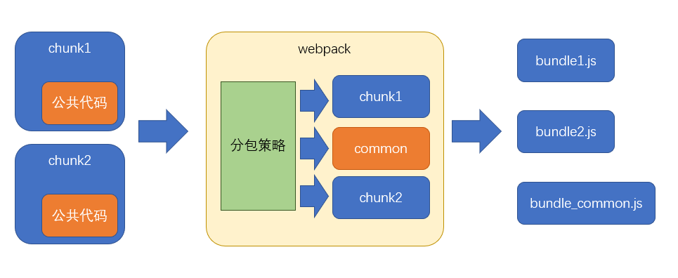

# 性能优化

1. 构建 —— 开发阶段 —— 开发效率
2. 传输 —— 打包后的 js 代码传输到浏览器的时间 ——总传输量、文件数量、浏览器缓存
3. 运行 —— js 代码在浏览器端的运行速度 —— 代码质量 （尾递归优化等，永远不要过早关注性能）

## ===========>构建

## 减少模块解析

- 甚至不解析模块。
- 什么叫模块解析？AST抽象语法树分析，记录依赖报存到 dependencies 中，替换依赖函数。
- 哪些模块不用解析呢？模块中无其他依赖（不进行 AST 抽象语法树分析，一些已经打包好的第三方库，例如：jquery）
    - `module: { noParse: /jquery/ }`

## 优化 loader 性能

### 限制 loader 的使用范围

- babel-loader 转换 es6 的语法，但是某些库把本身就是低版本写的，不需要 babel-loader 处理，例如：lodash 。
- 通过 `module.rules.exclude` 和 `module.rules.include` 排除掉或者仅仅支持哪些库进行配置。
    - 暴力写法，直接排除 `node_modules` 只管 src 目录下的代码。
    - noParse 和 exclude 不冲突，因为模块解析不包含 loader 处理。

### 缓存 loader 结果

- 代码内容不变，经过 loader 处理，结果不变。
- cache-loader 最后使用缓存 loader ，它最后执行的，怎么能实现后续使用缓存呢？
    - pitch 过程 loader.pitch = (filePath) => {}
- 指定缓存的路径

### 开启多线程（大项目）

- thread-loader 会开启一个线程池，线程池中包含适量的线程。
- 放到 cache-loader 后面，因为主要是为了处理模块解析耗时问题。后续的 loader 都会放到新线程中处理。
  1. 用 webapck api 生成文件 —— 不在 webpack 主线程。
  2. 不同使用自定义的 plugin api , 例如：  `mini-css-extact-plugin` 提供的 plugin 会向 webpack 注入了新的 api ,这时候就会报错。
  3. 无法访问 webpack options 。
  4. 放 babel-loader 等。

## 热替换(HMR)

> hot module replacement 热替换并不能降低构建时间（可能还会稍微增加），但可以降低代码改动到效果呈现的时间。

当使用`webpack-dev-server`时，考虑代码改动到效果呈现的过程


而使用了热替换后，流程发生了变化:


### 使用和原理

```js
module.exports = {
  devServer: {
    hot: true,
  },
  plugins: [
    // 可选
    new webpack.HotModuleReplacementPlugin()
  ]
}

// 判断是否开启热更新
if (module.hot) {
  module.hot.accept(); // 接受热更新
}
```

- `webpack-dev-server` 会向打包结果中注入 module.hot 属性，重新打包后，会调用 `location.reload()` 来刷新页面，但是如果运行了 `module.hot.accept` ，让 `webpack-dev-server` 通过 **socket 管道**，把服务器内容发送到浏览器。
- 
- 将结果交给 `HotModuleReplacementPlugin` 注入的代码执行，插件会覆盖原始代码，让代码重新执行。

### 样式热替换

- style-loader ,因为热替换发生时，只会简单地重新运行模块代码，因此 style-loader  的代码一运行，就会重新设置 style 中样式，但是 `mini-css-extract-plugin` 生成的文件是在**构建期间**，运行期间也无法改动文件，因此是无效的。

## ===========>传输性能

## 手动分包

### 基本原理

手动分包的总体思路是：

1. 先单独的打包公共模块


公共模块会被打包成为动态链接库(dll Dynamic Link Library)，并生成资源清单

2. 根据入口模块进行正常打包

打包时，如果发现模块中使用了资源清单中描述的模块，则不会形成下面的代码结构

```js
//源码，入口文件index.js
import $ from "jquery"
import _ from "lodash"
_.isArray($(".red"));
```

由于资源清单中包含`jquery`和`lodash`两个模块，因此打包结果的大致格式是：

```js
(function(modules){
  //...
})({
  // index.js文件的打包结果并没有变化
  "./src/index.js":
  function(module, exports, __webpack_require__){
    var $ = __webpack_require__("./node_modules/jquery/index.js")
    var _ = __webpack_require__("./node_modules/lodash/index.js")
    _.isArray($(".red"));
  },
  // 由于资源清单中存在，jquery的代码并不会出现在这里
  "./node_modules/jquery/index.js":
  function(module, exports, __webpack_require__){
    module.exports = jquery;
  },
  // 由于资源清单中存在，lodash的代码并不会出现在这里
  "./node_modules/lodash/index.js":
  function(module, exports, __webpack_require__){
    module.exports = lodash;
  }
})
```

### 打包公共模块

打包公共模块是一个**独立的**打包过程

1. 单独打包公共模块，暴露变量名

```js
// webpack.dll.config.js
module.exports = {
  mode: "production",
  entry: {
    jquery: ["jquery"],
    lodash: ["lodash"]
  },
  output: {
    filename: "dll/[name].js",
    library: "[name]"
  }
};

```

2. 利用`DllPlugin`生成资源清单

```js
// webpack.dll.config.js
module.exports = {
  plugins: [
    new webpack.DllPlugin({
      path: path.resolve(__dirname, "dll", "[name].manifest.json"), //资源清单的保存位置
      name: "[name]"//资源清单中，暴露的变量名
    })
  ]
};

```

运行后，即可完成公共模块打包

### 使用公共模块

1. 在页面中手动引入公共模块

```html
<script src="./dll/jquery.js"></script>
<script src="./dll/lodash.js"></script>
```

2. 重新设置`clean-webpack-plugin`

如果使用了插件`clean-webpack-plugin`，为了避免它把公共模块清除，需要做出以下配置

```js
new CleanWebpackPlugin({
  // 要清除的文件或目录
  // 排除掉dll目录本身和它里面的文件
  cleanOnceBeforeBuildPatterns: ["**/*", '!dll', '!dll/*']
})
```

> 目录和文件的匹配规则使用的是[globbing patterns](https://github.com/sindresorhus/globby#globbing-patterns)

3. 使用`DllReferencePlugin`控制打包结果

```js
module.exports = {
  plugins:[
    new webpack.DllReferencePlugin({
      manifest: require("./dll/jquery.manifest.json")
    }),
    new webpack.DllReferencePlugin({
      manifest: require("./dll/lodash.manifest.json")
    })
  ]
}

```

### 总结

**手动打包的过程**：

1. 开启`output.library`暴露公共模块
2. 用`DllPlugin`创建资源清单
3. 用`DllReferencePlugin`使用资源清单

**手动打包的注意事项**：

1. 资源清单不参与运行，可以不放到打包目录中
2. 记得手动引入公共JS，以及避免被删除
3. 不要对小型的公共JS库使用

**优点**：

1. 极大提升自身模块的打包速度
2. 极大的缩小了自身文件体积
3. 有利于浏览器缓存第三方库的公共代码

**缺点**：

1. 使用非常繁琐
2. 如果第三方库中包含重复代码，则效果不太理想

## 自动分包

### 基本原理

不同与手动分包，自动分包是从**实际的角度**出发，从一个更加**宏观的角度**来控制分包，而一般不对具体哪个包要分出去进行控制

因此使用自动分包，不仅非常方便，而且更加贴合实际的开发需要

要控制自动分包，关键是要配置一个合理的**分包策略**

有了分包策略之后，不需要额外安装任何插件，webpack会自动的按照策略进行分包

> 实际上，webpack在内部是使用`SplitChunksPlugin`进行分包的
> 过去有一个库`CommonsChunkPlugin`也可以实现分包，不过由于该库某些地方并不完善，到了`webpack4`之后，已被`SplitChunksPlugin`取代



从分包流程中至少可以看出以下几点：

- 分包策略至关重要，它决定了如何分包
- 分包时，webpack开启了一个**新的chunk**，对分离的模块进行打包
- 打包结果中，公共的部分被提取出来形成了一个单独的文件，它是新chunk的产物

### 分包策略的基本配置

webpack提供了`optimization`配置项，用于配置一些优化信息

其中`splitChunks`是分包策略的配置

```js
module.exports = {
  optimization: {
    splitChunks: {
      // 分包策略
    }
  }
}
```

事实上，分包策略有其默认的配置，我们只需要轻微的改动，即可应对大部分分包场景

1. chunks

该配置项用于配置需要应用分包策略的chunk

我们知道，分包是从已有的chunk中分离出新的chunk，那么哪些chunk需要分离呢

chunks有三个取值，分别是：

- all: 对于所有的chunk都要应用分包策略
- async：【默认】仅针对异步chunk应用分包策略
- initial：仅针对普通chunk应用分包策略

所以，你只需要配置`chunks`为`all`即可

2. maxSize

该配置可以控制包的最大字节数

如果某个包（包括分出来的包）超过了该值，则webpack会尽可能的将其分离成多个包

但是不要忽略的是，分包的**基础单位是模块**，如果一个完整的模块超过了该体积，它是无法做到再切割的，因此，尽管使用了这个配置，完全有可能某个包还是会超过这个体积

另外，该配置看上去很美妙，实际意义其实不大

因为分包的目的是**提取大量的公共代码**，从而减少总体积和充分利用浏览器缓存

虽然该配置可以把一些包进行再切分，但是实际的总体积和传输量并没有发生变化

> 如果要进一步减少公共模块的体积，只能是压缩和`tree shaking`

### 分包策略的其他配置

如果不想使用其他配置的默认值，可以手动进行配置：

- automaticNameDelimiter：新chunk名称的分隔符，默认值~
- minChunks：一个模块被多少个chunk使用时，才会进行分包，默认值1
- minSize：当分包达到多少字节后才允许被真正的拆分，默认值30000

### 缓存组

之前配置的分包策略是全局的

而实际上，分包策略是基于缓存组的

每个缓存组提供一套独有的策略，webpack按照缓存组的优先级依次处理每个缓存组，被缓存组处理过的分包不需要再次分包

默认情况下，webpack提供了两个缓存组：

```js
module.exports = {
  optimization:{
    splitChunks: {
      //全局配置
      cacheGroups: {
        // 属性名是缓存组名称，会影响到分包的chunk名
        // 属性值是缓存组的配置，缓存组继承所有的全局配置，也有自己特殊的配置
        vendors: {
          test: /[\\/]node_modules[\\/]/, // 当匹配到相应模块时，将这些模块进行单独打包
          priority: -10 // 缓存组优先级，优先级越高，该策略越先进行处理，默认值为0
        },
        default: {
          minChunks: 2,  // 覆盖全局配置，将最小chunk引用数改为2
          priority: -20, // 优先级
          reuseExistingChunk: true // 重用已经被分离出去的chunk
        }
      }
    }
  }
}
```

很多时候，缓存组对于我们来说没什么意义，因为默认的缓存组就已经够用了

但是我们同样可以利用缓存组来完成一些事情，比如对公共样式的抽离

```js
module.exports = {
  optimization: {
    splitChunks: {
      chunks: "all",
      cacheGroups: {
        styles: {
          test: /\.css$/, // 匹配样式模块
          minSize: 0, // 覆盖默认的最小尺寸，这里仅仅是作为测试
          minChunks: 2 // 覆盖默认的最小chunk引用数
        }
      }
    }
  },
  module: {
    rules: [{ test: /\.css$/, use: [MiniCssExtractPlugin.loader, "css-loader"] }]
  },
  plugins: [
    new CleanWebpackPlugin(),
    new HtmlWebpackPlugin({
      template: "./public/index.html",
      chunks: ["index"]
    }),
    new MiniCssExtractPlugin({
      filename: "[name].[hash:5].css",
      // chunkFilename是配置来自于分割chunk的文件名
      chunkFilename: "common.[hash:5].css"
    })
  ]
}
```

### 配合多页应用

虽然现在单页应用是主流，但免不了还是会遇到多页应用

由于在多页应用中需要为每个html页面指定需要的chunk，这就造成了问题

```js
new HtmlWebpackPlugin({
  template: "./public/index.html",
  chunks: ["index~other", "vendors~index~other", "index"]
})
```

我们必须手动的指定被分离出去的chunk名称，这不是一种好办法

幸好`html-webpack-plugin`的新版本中解决了这一问题

```shell
npm i -D html-webpack-plugin@next
```

做出以下配置即可：

```js
new HtmlWebpackPlugin({
  template: "./public/index.html",
  chunks: ["index"]
})
```

它会自动的找到被`index`分离出去的chunk，并完成引用

> 目前这个版本仍处于测试解决，还未正式发布？现在呢？

### 原理

自动分包的原理其实并不复杂，主要经过以下步骤：

1. 检查每个chunk编译的结果
2. 根据分包策略，找到那些满足策略的模块
3. 根据分包策略，生成新的chunk打包这些模块（代码有所变化）
4. 把打包出去的模块从原始包中移除，并修正原始包代码

在代码层面，有以下变动

1. 分包的代码中，加入一个全局变量，类型为数组，其中包含公共模块的代码
2. 原始包的代码中，使用数组中的公共代码

## 压缩代码

### 前言

1. **为什么要进行代码压缩**

减少代码体积；破坏代码的可读性，提升破解成本；

2. **什么时候要进行代码压缩**

生产环境

3. **使用什么压缩工具**

目前最流行的代码压缩工具主要有两个：`UglifyJs`和`Terser`

`UglifyJs`是一个传统的代码压缩工具，已存在多年，曾经是前端应用的必备工具，但由于它不支持`ES6`语法，所以目前的流行度已有所下降。

`Terser`是一个新起的代码压缩工具，支持`ES6+`语法，因此被很多构建工具内置使用。`webpack`安装后会内置`Terser`，当启用生产环境后即可用其进行代码压缩。

因此，我们选择`Terser`

**关于副作用 side effect**

副作用：函数运行过程中，可能会对外部环境造成影响的功能

如果函数中包含以下代码，该函数叫做副作用函数:

- 异步代码
- localStorage
- 对外部数据的修改

如果一个函数没有副作用，同时，函数的返回结果仅依赖参数，则该函数叫做纯函数(pure function)

### Terser

在`Terser`的官网可尝试它的压缩效果

> Terser官网：https://terser.org/

### webpack + Terser

webpack自动集成了Terser

如果你想更改、添加压缩工具，又或者是想对Terser进行配置，使用下面的webpack配置即可

```js
const TerserPlugin = require('terser-webpack-plugin');
const OptimizeCSSAssetsPlugin = require('optimize-css-assets-webpack-plugin');
module.exports = {
  optimization: {
    // 是否要启用压缩，默认情况下，生产环境会自动开启
    minimize: true,
    minimizer: [ // 压缩时使用的插件，可以有多个
      new TerserPlugin(),
      new OptimizeCSSAssetsPlugin()
    ],
  },
};
``
