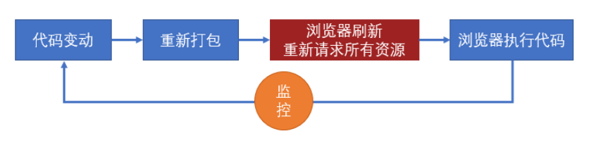
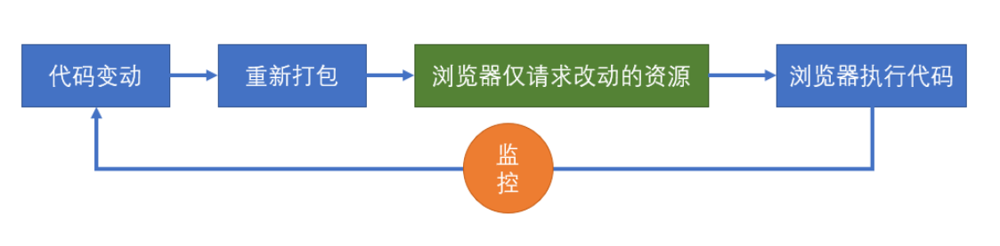
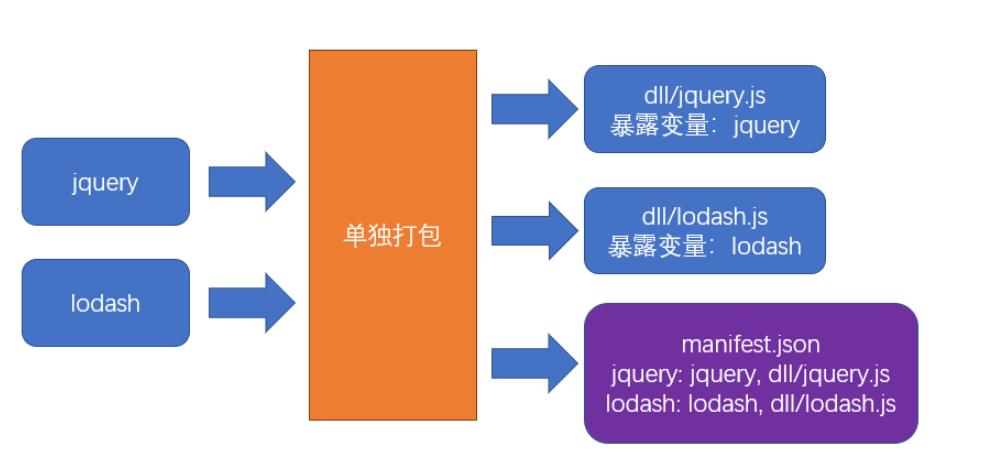

# 性能优化

1. 构建 —— 开发阶段 —— 开发效率
2. 传输 —— 打包后的 js 代码传输到浏览器的时间 ——总传输量、文件数量、浏览器缓存
3. 运行 —— js 代码在浏览器端的运行速度 —— 代码质量 （尾递归优化等，永远不要过早关注性能）

## 构建

### 减少模块解析

- 甚至不解析模块。 
- 什么叫模块解析？AST抽象语法树分析，记录依赖报存到 dependencies 中，替换依赖函数。
- 哪些模块不用解析呢？模块中无其他依赖（不进行 AST 抽象语法树分析，一些已经打包好的第三方库，例如：jquery）
  - `module: { noParse: /jquery/ }`

### 优化 loader 性能

#### 限制 loader 的使用范围

- babel-loader 转换 es6 的语法，但是某些库把本身就是低版本写的，不需要 babel-loader 处理，例如：lodash 。
- 通过 `module.rules.exclude` 和 `module.rules.include` 排除掉或者仅仅支持哪些库进行配置。
  - 暴力写法，直接排除 `node_modules` 只管 src 目录下的代码。
  - noParse 和 exclude 不冲突，因为模块解析不包含 loader 处理。

#### 缓存 loader 结果

- 代码内容不变，经过 loader 处理，结果不变。
- cache-loader 最后使用缓存 loader ，它最后执行的，怎么能实现后续使用缓存呢？
  - pitch 过程 loader.pitch = (filePath) => {}
- 指定缓存的路径

#### 开启多线程（大项目）

- thread-loader 会开启一个线程池，线程池中包含适量的线程。
- 放到 cache-loader 后面，因为主要是为了处理模块解析耗时问题。后续的 loader 都会放到新线程中处理。
  1. 用 webapck api 生成文件 —— 不在 webpack 主线程。
  2. 不同使用自定义的 plugin api , 例如：  `mini-css-extact-plugin` 提供的 plugin 会向 webpack 注入了新的 api ,这时候就会报错。
  3. 无法访问 webpack options 。
  4. 放 babel-loader 等。

### 热替换(HMR)

> hot module replacement 热替换并不能降低构建时间（可能还会稍微增加），但可以降低代码改动到效果呈现的时间。

当使用`webpack-dev-server`时，考虑代码改动到效果呈现的过程



而使用了热替换后，流程发生了变化:




#### 使用和原理
   
```js
module.exports = {
  devServer: {
    hot: true,
  },
  plugins: [
    // 可选
    new webpack.HotModuleReplacementPlugin()
  ]
}

// 判断是否开启热更新 
if (module.hot) {
  module.hot.accept(); // 接受热更新
}
```

- `webpack-dev-server` 会向打包结果中注入 module.hot 属性，重新打包后，会调用 `location.reload()` 来刷新页面，但是如果运行了 `module.hot.accept` ，让 `webpack-dev-server` 通过 **socket 管道**，把服务器内容发送到浏览器。
- 
- 将结果交给 `HotModuleReplacementPlugin` 注入的代码执行，插件会覆盖原始代码，让代码重新执行。 

#### 样式热替换

- style-loader ,因为热替换发生时，只会简单地重新运行模块代码，因此 style-loader  的代码一运行，就会重新设置 style 中样式，但是 `mini-css-extract-plugin` 生成的文件是在**构建期间**，运行期间也无法改动文件，因此是无效的。

## 传输性能

### 手动分包 

#### 基本原理

手动分包的总体思路是：

1. 先单独的打包公共模块



公共模块会被打包成为动态链接库(dll Dynamic Link Library)，并生成资源清单

2. 根据入口模块进行正常打包

打包时，如果发现模块中使用了资源清单中描述的模块，则不会形成下面的代码结构

```js
//源码，入口文件index.js
import $ from "jquery"
import _ from "lodash"
_.isArray($(".red"));
```

由于资源清单中包含`jquery`和`lodash`两个模块，因此打包结果的大致格式是：

```js
(function(modules){
  //...
})({
  // index.js文件的打包结果并没有变化
  "./src/index.js":
  function(module, exports, __webpack_require__){
    var $ = __webpack_require__("./node_modules/jquery/index.js")
    var _ = __webpack_require__("./node_modules/lodash/index.js")
    _.isArray($(".red"));
  },
  // 由于资源清单中存在，jquery的代码并不会出现在这里
  "./node_modules/jquery/index.js":
  function(module, exports, __webpack_require__){
    module.exports = jquery;
  },
  // 由于资源清单中存在，lodash的代码并不会出现在这里
  "./node_modules/lodash/index.js":
  function(module, exports, __webpack_require__){
    module.exports = lodash;
  }
})
```

#### 打包公共模块

打包公共模块是一个**独立的**打包过程

1. 单独打包公共模块，暴露变量名

```js
// webpack.dll.config.js
module.exports = {
  mode: "production",
  entry: {
    jquery: ["jquery"],
    lodash: ["lodash"]
  },
  output: {
    filename: "dll/[name].js",
    library: "[name]"
  }
};

```

2. 利用`DllPlugin`生成资源清单

```js
// webpack.dll.config.js
module.exports = {
  plugins: [
    new webpack.DllPlugin({
      path: path.resolve(__dirname, "dll", "[name].manifest.json"), //资源清单的保存位置
      name: "[name]"//资源清单中，暴露的变量名
    })
  ]
};

```

运行后，即可完成公共模块打包

#### 使用公共模块

1. 在页面中手动引入公共模块

```html
<script src="./dll/jquery.js"></script>
<script src="./dll/lodash.js"></script>
```

2. 重新设置`clean-webpack-plugin`

如果使用了插件`clean-webpack-plugin`，为了避免它把公共模块清除，需要做出以下配置

```js
new CleanWebpackPlugin({
  // 要清除的文件或目录
  // 排除掉dll目录本身和它里面的文件
  cleanOnceBeforeBuildPatterns: ["**/*", '!dll', '!dll/*']
})
```

> 目录和文件的匹配规则使用的是[globbing patterns](https://github.com/sindresorhus/globby#globbing-patterns)

3. 使用`DllReferencePlugin`控制打包结果

```js
module.exports = {
  plugins:[
    new webpack.DllReferencePlugin({
      manifest: require("./dll/jquery.manifest.json")
    }),
    new webpack.DllReferencePlugin({
      manifest: require("./dll/lodash.manifest.json")
    })
  ]
}

```

### 总结

**手动打包的过程**：

1. 开启`output.library`暴露公共模块
2. 用`DllPlugin`创建资源清单
3. 用`DllReferencePlugin`使用资源清单

**手动打包的注意事项**：

1. 资源清单不参与运行，可以不放到打包目录中
2. 记得手动引入公共JS，以及避免被删除
3. 不要对小型的公共JS库使用

**优点**：

1. 极大提升自身模块的打包速度
2. 极大的缩小了自身文件体积
3. 有利于浏览器缓存第三方库的公共代码

**缺点**：

1. 使用非常繁琐
2. 如果第三方库中包含重复代码，则效果不太理想


