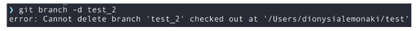
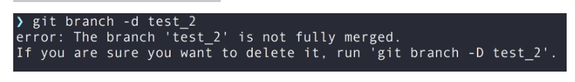

# Git | 分布式版本控制系统


## 前言

> Git 是一个开源的分布式版本控制系统，用于敏捷高效地处理任何或小或大的项目。 

文档：<https://git-scm.com/book/en/v2>

## 忽略文件

一般我们总会有些文件无需纳入 Git 的管理，也不希望它们总出现在未跟踪文件列表。 通常都是些自动生成的文件，比如日志文件，或者编译过程中创建的临时文件等。 在这种情况下，我们可以创建一个名为 .gitignore 的文件，列出要忽略的文件的模式。 来看一个实际的 .gitignore 例子：

```bash
$ cat .gitignore
*.[oa]
*~
```

第一行告诉 Git 忽略所有以 .o 或 .a 结尾的文件。一般这类对象文件和存档文件都是编译过程中出现的。 第二行告诉 Git 忽略所有名字以波浪符（~）结尾的文件，许多文本编辑软件（比如 Emacs）都用这样的文件名保存副本。 此外，你可能还需要忽略 log，tmp 或者 pid 目录，以及自动生成的文档等等。 要养成一开始就为你的新仓库设置好 .gitignore 文件的习惯，以免将来误提交这类无用的文件。

文件 .gitignore 的格式规范如下：
- 所有空行或者以 # 开头的行都会被 Git 忽略。

- 可以使用标准的 glob 模式匹配，它会递归地应用在整个工作区中。

- 匹配模式可以以（/）开头防止递归。

- 匹配模式可以以（/）结尾指定目录。

- 要忽略指定模式以外的文件或目录，可以在模式前加上叹号（!）取反。

所谓的 glob 模式是指 shell 所使用的简化了的正则表达式。 星号（*）匹配零个或多个任意字符；[abc] 匹配任何一个列在方括号中的字符 （这个例子要么匹配一个 a，要么匹配一个 b，要么匹配一个 c）； 问号（?）只匹配一个任意字符；如果在方括号中使用短划线分隔两个字符， 表示所有在这两个字符范围内的都可以匹配（比如 [0-9] 表示匹配所有 0 到 9 的数字）。 使用两个星号（\*\*）表示匹配任意中间目录，比如 a/\*\*/z 可以匹配 a/z 、 a/b/z 或 a/b/c/z 等。

我们再看一个 .gitignore 文件的例子：

```bash
# 忽略所有的 .a 文件
*.a

# 但跟踪所有的 lib.a，即便你在前面忽略了 .a 文件
!lib.a

# 只忽略当前目录下的 TODO 文件，而不忽略 subdir/TODO
/TODO

# 忽略任何目录下名为 build 的文件夹
build/

# 忽略 doc/notes.txt，但不忽略 doc/server/arch.txt
doc/*.txt

# 忽略 doc/ 目录及其所有子目录下的 .pdf 文件
doc/**/*.pdf
```
> Tip: GitHub 有一个十分详细的针对数十种项目及语言的 .gitignore 文件列表， 你可以在 <https://github.com/github/gitignore> 找到它。

## 撤销操作

1. 用新提交抵消之前的操作。—— 产生新提交。
- 一种常见的场景是，提交代码以后，你突然意识到这个提交有问题，应该撤销掉，这时执行`git revert HEAD`命令就可以了。
- 上面命令的原理是，在当前提交后面，新增一次提交，抵消掉上一次提交导致的所有变化。它不会改变过去的历史，所以是首选方式，没有任何丢失代码的风险。(因为公司内部需要漂亮的 commit 列表所以这种方式不行的。)
- `git revert` 命令只能抵消上一个提交，如果想抵消多个提交，必须在命令行依次指定这些提交。比如，抵消前两个提交，要像下面这样写。`git revert [倒数第一个提交] [倒数第二个提交]`
- git revert命令还有两个参数。

  ```
  --no-edit：执行时不打开默认编辑器，直接使用 Git 自动生成的提交信息。
  --no-commit：只抵消暂存区和工作区的文件变化，不产生新的提交。
  ```

2. 丢弃提交

- 如果希望以前的提交在历史中彻底消失，而不是被抵消掉，可以使用git reset命令，丢弃掉某个提交之后的所有提交。(常用！！保证自己的改动只有一个 commit)
- `git reset [last good SHA]`
- git reset 的原理是，让最新提交的指针回到以前某个时点，该时点之后的提交都从历史中消失。默认情况下，git reset不改变工作区的文件（但会改变暂存区），--hard参数可以让工作区里面的文件也回到以前的状态。
- 执行git reset命令之后，如果想找回那些丢弃掉的提交，可以使用git reflog命令，具体做法参考[这里](https://github.blog/2015-06-08-how-to-undo-almost-anything-with-git/#redo-after-undo-local)。不过，这种做法有时效性，时间长了可能找不回来。

3. 修改上一次提交

- `git commit --amend`

- 这个命令会将暂存区中的文件提交。 如果自上次提交以来你还未做任何修改（例如，在上次提交后马上执行了此命令）， 那么快照会保持不变，而你所修改的只是提交信息。
- 修补提交最明显的价值是可以稍微改进你最后的提交，而不会让“啊，忘了添加一个文件”或者 “小修补，修正笔误”这种提交信息弄乱你的仓库历史。

  > Tip: 记住，在 Git 中任何 已提交 的东西几乎总是可以恢复的。 甚至那些被删除的分支中的提交或使用 --amend 选项覆盖的提交也可以恢复 （阅读 [数据恢复](https://git-scm.com/book/zh/v2/Git-%E5%86%85%E9%83%A8%E5%8E%9F%E7%90%86-%E7%BB%B4%E6%8A%A4%E4%B8%8E%E6%95%B0%E6%8D%AE%E6%81%A2%E5%A4%8D#_data_recovery) 了解数据恢复）。 然而，任何你未提交的东西丢失后很可能再也找不到了。

4. 撤销工作区文件修改
  
- 如果工作区的某个文件被改乱了，但还没有提交，可以用`git checkout`命令找回本次修改之前的文件。
- 它的原理是先找暂存区，如果该文件有暂存的版本，则恢复该版本，否则恢复上一次提交的版本。注意，工作区的文件变化一旦被撤销，就无法找回了。

5. 从暂存区撤销文件
   
- 如果不小心把一个文件添加到暂存区，可以用下面的命令撤销。`git rm --cached [filename]`不影响已经提交的内容。

6. 撤销当前分支的变化

- 你在当前分支上做了几次提交，突然发现放错了分支，这几个提交本应该放到另一个分支。

  ```
  # 新建一个 feature 分支，指向当前最新的提交
  # 注意，这时依然停留在当前分支
  $ git branch feature

  # 切换到这几次提交之前的状态
  $ git reset --hard [当前分支此前的最后一次提交]

  # 切换到 feature 分支
  $ git checkout feature
  ```

- 上面的操作等于是撤销当前分支的变化，将这些变化放到一个新建的分支。

- [回滚](https://cloud.tencent.com/developer/article/1582800)
## 贮藏

```bash
git stash list
```
要查看贮藏的东西，可以使用 git stash list。想要应用其中一个更旧的贮藏，可以通过名字指定它，像这样：git stash apply stash@{2}

- 从贮藏创建一个分支

如果贮藏了一些工作，将它留在那儿了一会儿，然后继续在贮藏的分支上工作，在重新应用工作时可能会有问题。 如果应用尝试修改刚刚修改的文件，你会得到一个合并冲突并不得不解决它。 如果想要一个轻松的方式来再次测试贮藏的改动，可以运行 `git stash branch <new branchname>` 以你指定的分支名创建一个新分支，检出贮藏工作时所在的提交，重新在那应用工作，然后在应用成功后丢弃贮藏：

## 删除分支

### 删除本地分支

```js
// -d 是一个标志，是命令的一个选项，它是 --delete 
git branch -d local_branch_name 
// 列出所有本地分支
git branch
```

无法删除所在的分支，会报以下的错误：



因此，在删除本地分支之前，请确保使用以下git checkout命令切换到您不想删除的另一个分支。

我们刚刚使用的删除本地分支的命令并非在所有情况下都有效。如果分支包含未合并的更改和未推送的提交，则该-d 标志将不允许删除本地分支。这是因为任何其他分支都看不到提交，并且 Git 正在保护您免于意外丢失任何提交数据。如果你尝试这样做，Git 会显示一个错误：



正如错误所暗示的那样，您需要改用该 -D 标志：`git branch -D local_branch_name`

-D带有大写-- delete --force字母D的标志会强行删除本地分支，无论其合并状态如何。但请注意，您应该谨慎使用此命令，因为没有提示要求您确认您的操作。仅当您绝对确定要删除本地分支时才使用它。如果您没有将其合并到另一个本地分支或将其推送到代码库中的远程分支，您将面临丢失所做的任何更改的风险。

### 修改远程分支

远程分支与本地分支是分开的。删除远程分支的命令是：`git push remote_name -d remote_branch_name`

`git branch -a`显示所有分支机构 - 本地和远程。我想删除远程 origin/test 分支，所以我使用命令：`git push origin -d test`

## 解决冲突

通常情况下需要 `git fetch + git rebase` 解决！合并代码后，重新 `git add` 然后 `git rebase --continue`相当于 --amend 修改上一次的 commit 。